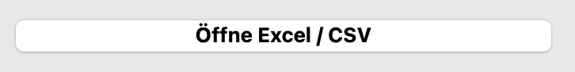
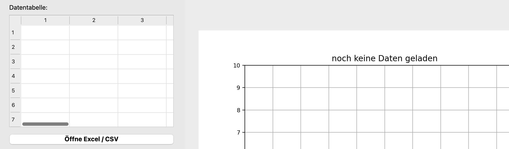
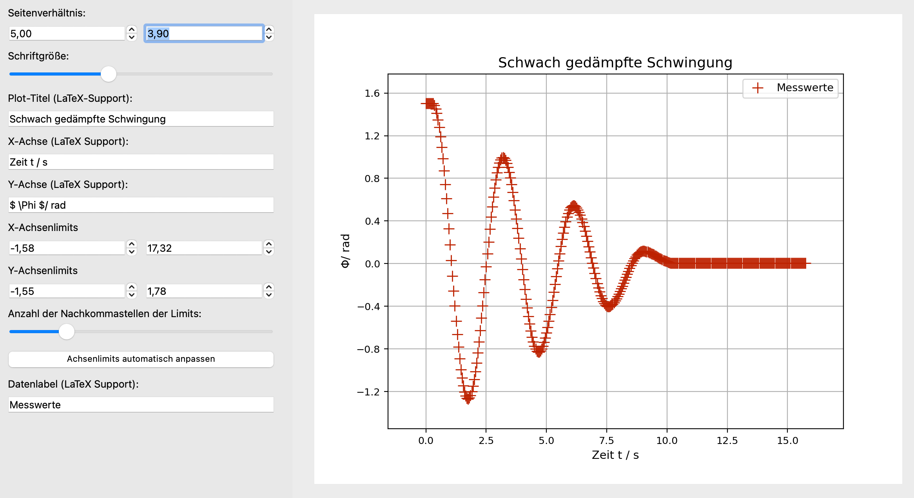
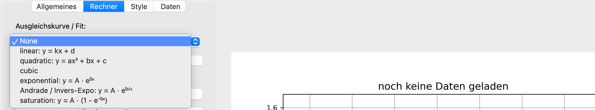
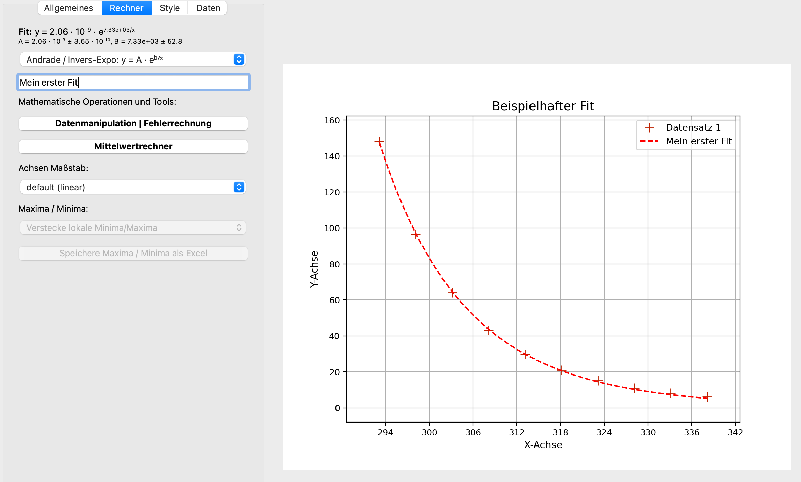
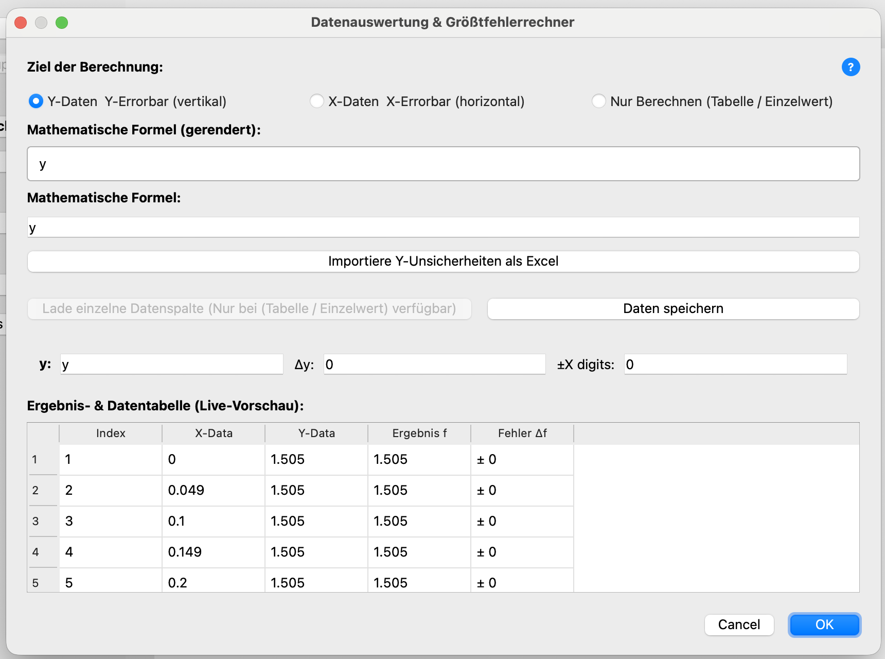
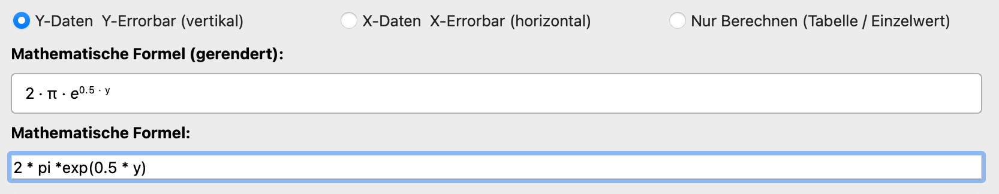

# Protokollix 📊

**Protokollix** ist ein leichtgewichtiges Desktop-Werkzeug zur schnellen Datenauswertung, interaktiven Plot-Erstellung und automatisierten Größtfehlerberechnung – optimiert für physikalische Praktika und wissenschaftliche Laborberichte. Es wurde in erster Linie entwickelt, um Zeit bei der Versuchsauswertung zu sparen. 

---

## Inhaltsverzeichnis
- [Installation & Download](#installation--download)
- [Schnellstart](#schnellstart)
- [Dateneinlese und Datenformat (Excel / CSV)](#dateneinlese-und-datenformat-excel--csv)
- [Grafische Manipulationen im Überblick](#grafische-manipulationen-im-überblick)
- [Mathematische Manipulationen im Überblick](#mathematische-manipulationen-im-überblick)
- [Größtfehler-Rechner (Syntax)](#größtfehler-rechner-syntax)
- [Kontakt & Feedback](#kontakt--feedback)

---

## Installation & Download

### Option 1: Fertige Anwendung (Empfohlen – kein Python nötig)
Die fertigen Programme für Windows und macOS findest du rechts unter **[Releases](https://github.com/DEIN_NUTZERNAME/Protokollix/releases)**:

1. Lade für dein Betriebssystem das neueste Archiv herunter (`Protokollix_Windows.zip` oder `Protokollix_Mac.zip`).
2. Entpacke die Datei.
3. Starte die Anwendung per Doppelklick (keine Python-Installation erforderlich).

### Option 2: Direkt aus dem Quellcode ausführen (Python erforderlich)

Falls du Python bereits installiert hast oder den Quellcode anpassen möchtest:

1. Klone das Repository oder lade `script.py` herunter.
2. Installiere die benötigten Abhängigkeiten im Terminal:

   ```bash
   pip install PySide6 numpy pandas matplotlib scipy sympy openpyxl

---

## Schnellstart

1. Klicke auf **„Öffne Excel / CSV“** und wähle deine Messdatei aus.
2. Wähle im rechten Bedienfeld unter **Data** die gewünschte Y-Messreihe aus.
3. Passe Achsenbeschriftungen, Skalierung (linear/logarithmisch) und Kurvenanpassungen (z. B. Polynom- oder Exponential-Fit) an.
4. Exportiere das fertige Diagramm über **„Save Plot“** als hochauflösende PDF- oder PNG-Grafik für dein Protokoll.

---

## Dateneinlese und Datenformat (Excel / CSV)

### Daten importieren über Dateien 
---

Derzeit können entweder Excel oder CSV Dateien importiert werden - andere Dateitypen werden nicht unterstützt. Der Button zum Einlesen von Daten befindet sich im linken Menü im rechtesten Tab "Daten", wie in der Grafik ersichtlich:

<p align="center">
  <br>
  <em>Abbildung 1: Der Import-Button.</em>
</p>

<br>
Damit Protokollix Dateien fehlerfrei einliest, muss die Datei wie folgt aufgebaut sein:

* **Spalte 1:** X-Werte (Messzeit, Spannung, etc.)
* **Folgende Spalten:** Y-Werte (Messreihen)
* Optional: Zeile 1 als Spaltentitel (Header)

| X (Zeit in s) | Y1 (Strom in A) | Y2 (Spannung in V) |
| :--- | :--- | :--- |
| 1.0 | 0.25 | 1.20 |
| 2.0 | 0.51 | 2.38 |
| 3.0 | 0.74 | 3.61 |

Das Programm gibt eine Warnung aus, falls die eingelesenen Daten nicht passen, und zeigt zusätzlich beim Importieren nochmal das erwünschte Format an. 

> [!TIP]
> Dezimaltrennzeichen: Sowohl Punkte (`1.25`) als auch Kommas (`1,25`) werden beim Einlesen automatisch erkannt und konvertiert.

<br>

> [!TIP]
> Beim erstmaligen Einlesen der Mesdaten mithilfe des **Öffne Excel/CSV** Buttons kann es zu kurzen Verzögerungen kommen. Das Programm signalisiert durch eine Änderung des Mauscursors, dass es im Hintergrund arbeitet. Der Grund dafür ist, dass im Moment des Ladens die Funktion `find_peaks` aus der Bibliothek `SciPy`geladen wird, um direkt abzugleichen, ob die Messdaten Maxima und/oder Minima enthalten, was je nach Betriebssystem und Performance 1-10 Sekunden dauer kann. 


### Daten importieren mithilfe der eingebauten Tabellenfunktion
---


Zusätzlich is es für schnelle Tests und Änderungen möglich, Daten über die eingebaute Tabellenansicht zu erstellen. Diese befindet sich ebenfalls im `Daten-Tab`, links neben dem Plot:
<p align="center">
  <br>
  <em>Abbildung 2: Die integrierte Tabelle zur Dateneingabe und Manipulation</em>
</p>

<br>

Sofern keine Messdaten geladen importiert wurden, ist es möglich, Daten in die Tabelle einzugeben. Sollte dort ausversehen ein Fehler gemacht werden, also z.B. ein X-Wert oder ein Y-Wert gelöscht oder vergessen werden, so fängt das Programm den Fehler automatisch ab und der entsprechende Punkt im Plot verschwindet. Nachdem man Daten auf diese Weise hinzugefügt hat, sollte noch im Zentralen Messdaten Auswahlfenster unter dem Tab **Allgemeines** der neu hinzugefügte Datensatz ausgewählt werden:

<p align="center">
  <br>
  <em>Abbildung 3: Der Aktive Datensatz kann über ein kleines Menü ausgewählt werden. </em>
</p>

<br>

Die Option `Keine Daten geladen` verschwindet aus dem Auswahlfenster, sobald Daten über den Importierbutton importiert wurden.

> [!TIP]
> Bei wichtigen Datenmengen empfiehlt es sich, die Daten in einer CSV oder Excel zu protokollieren - die Daten, die manuell zur Tabelle in Protokollix hinzugefügt werden, können zwar über den Button `Datenmanipulation | Fehlerrechnung` als Exceldatei exportiert werden, angedacht ist das aber nicht unbedingt. 

---

## Grafische Manipulationen im Überblick

Protokollix unterstützt zahlreiche Features, die sonst einen eigenen Python Code erfordern würden, indem es im Hintergrund auf die Bibliothek `Matplotlib`zugreift.
Viele Eingabefelder für Text unterstützen außerdem standardgemäß bereits `LaTeX` Notation. Dabei folgt das Programm dem *"What you see is what you get"* Prinzip: Sämtliche getätigten Einstellungen werden sofort grafisch umgesetzt, der Plot, den man exportiert, ist exakt der Plot, den man im Programm auch sieht. <br>
Angepasst werden können im Plot zum Beispiel:
* **Seitenverhältnis des Plots, Schriftgröße, Datenlabel**
* **X- und Y-Achsenlimits sowie Beschriftungen und der Achsenmaßstab (lineare Achsen, halblogarithmische Achsen, logarithmische Achsen)**
* **Linestyle (Liniendarstellung), Markerstyle (Darstellung der Datenpunkte) und Markergröße (Größe der Datenpunkte)**
* **Grid (Gitter) Ja/Nein, Farbe der Linien und der Datenpunkte, Legendenposition**

Die entsprechenden Eingabe- und Manipulationsfelder finden sich in den Tabs **Allgemeines**, **Rechner** und **Style**. 
Ein mögliches Beispiel für die verschiedenen Einstellungsmöglichkeiten könnte wie folgt aussehen:

<p align="center">
  <br>
  <em>Abbildung 4: Ein Beispiel für ein Plot, der mit Protokollix erstellt wurde.</em>
</p>

---

## Mathematische Manipulationen im Überblick

Die genannten Grafischen Funktionen sind praktisch, die wirkliche Stärke des Programms liegt jedoch in der Möglichkeit, mathematische Operationen mit den Daten durchzuführen.
Zur Verfügung stehen (Stand September 2026): 
* **Ausgleichskurven / Fits:** Fits durch Messdaten legen

* **Datenmanipulation und Fehlerrechung:** Sämtliche gängige Manipulationen, sowie ein Fehlerrechner, der den größtmöglichen Fehler nach der Ableitungsmethode für beliebig viele Variablen berechnet Unsicherheiten können sowohl in Prozent als auch zusätztlich als DIGIT eingegeben werden.

* **Mittelwertrechner:** Berechnet den Mittelwert und die Standardabweichung von beliebig vielen Messdaten, die extra importiert werden können, mehrere Mittelwerteberechnungen gleichzeitig sind möglich.
* **Maxima/Minima:** Berechnet die lokalen Maxima und/oder Minima einer Funktion. Anschließend können diese als Excel Datei exportiert werden*
---
### Ausgleichskurve/Fit
Häufig ist es in Versuchen nötig, einen Fit durch Messdaten zu legen. In Protokollix findet sich diese Funktion im **Rechner** Tab. Folgende Fits stehen zur Auswahl: 

<p align="center">
  <br>
  <em>Abbildung 5: Die verfügbaren Fits.</em>
</p>
<br>
Sobald ein Fit ausgewählt wurde, kann das Label des Fits in dem darunterliegenden Textfeld eingegeben werden. Mehrere Fits im selben Plot sind derzeit **nicht** möglich, sind im Laboralltag aber auch sehr selten. 
Will man einen Fit durch Messdaten legen, lädt man im ersten Schritt die Messdaten und wählt anschließend einfach den gewünschten Fit aus. Die Parameter **inklusive** deren Unsicherheiten werden sofort über dem Fit anzeigt, wie an folgendem Beispiel zu sehen ist:

<br>

<p align="center">
  <br>
  <em>Abbildung 6: Ein Beispiel für einen möglichen Fit. Die Fitparameter sind oben rechts zu sehen.</em>
</p>

---


### Größtfehler-Rechner

Durch das Klicken auf den Button **Datenmanipulation | Fehlerrechung** öffnet sich ein eigenes Fenster, der **Rechner**. Dieser ist eines der Herzstücke des ganzen Programms.
<p align="center">
  <br>
  <em>Abbildung 7: Durch Klicken des Buttons öffnet sich der Rechner.</em>
</p>

#### Auswahlmenü für die Daten

Ganz oben im neu geöffneten Fenster stehen drei Auswahlmöglichkeiten zur Verfügung, die unterscheiden, was mit den manipulierten Daten geschieht:
* **Y-Daten & Y-Errorbar (vertikal)**: Wird diese Option gewählt, so beziehen sich sämtliche Rechnungen und Unsicherheiten auf die Y-Daten. Ein automatisch generiertes `Y`im Eingabefeld verdeutlicht dies zusätzlich. Ist diese Option gewält können also die vorher geladenen Y-Daten manipuliert werden. Die aus den Unsicherheiten generierten Fehlerbalken sind also vertikal, weil sie die Y-Unsicherheiten angeben. Will man die manipulierten Daten im Anschluss exportieren, kann der Button `Daten speichern` genutzt werden.

* **X-Daten & X-Errorbar (horizontal)**: Wird diese Option gewählt, so beziehen sich sämtliche Rechnungen und Unsicherheiten auf die X-Daten. Ein automatisch generiertes `X`im Eingabefeld verdeutlicht dies zusätzlich. Ist diese Option gewält können also die vorher geladenen X-Daten manipuliert werden. Die aus den Unsicherheiten generierten Fehlerbalken sind also horizontal, weil sie die X-Unsicherheiten angeben. Will man die manipulierten Daten im Anschluss exportieren, kann der Button `Daten speichern` genutzt werden.

* **Nur Berechnen (Tabelle / Einzelwert)**: Teilweise ist es gar nicht notwendig, Daten zu plotten, sondern nur, eine Messreihe mathematisch zu manipulieren. Da das Programm aber beim Import immer X- und Y-Daten benötigt, gibt es eine dritte Option, die ausschließlich dem Berechnen dient. Über einen extra Button `Lade einzelne Datenspalte` kann eine einzelne Y-Messreihe geladen und manipuliert werden. Im Anschluss kann diese mithilfe des Buttons `Daten speichern` exportiert werden. 

#### Eingabezeile

Direkt unter dem Auswahlmenü liegen die Zeile **Mathematische Formel (gerendert)** sowie **Mathematische Formel**:

* **Mathematische Formel (gerendert)**: Dieses Feld erlaubt keine Eingaben, und dient lediglich der schöneren Grafischen Darstellung der eingebenen Befehle.
* **Mathematische Formel**: In diesem Feld können Befehle eingeben werden. 

<p align="center">
  <br>
  <em>Abbildung 7: Ein Feld dient der gerenderten Darstellung, eines der Eingabe.</em>
</p>


Der integrierte Rechner nutzt symbolische Computeralgebra (SymPy). Beim Eingeben der Berechnungsformel gelten folgende mathematische Standards:

* Addition/Subtraktion: `+`, `-`
* Multiplikation und Divisionen: `*` (z. B. `m * g * h`),  `/` (z.B. `y/2`)
* Potenzen: `**` (z. B. `r**2` für $r^2$). Die `LaTeX` Notation `^`kann ebenfalls verwendet werden. Eine e-Funktion wird durch den Ausdruck `exp()`realisiert.
* Funktionen: `sin(...)`, `cos(...)`, `sqrt(...)`, `exp(...)`, `log(...)`. `log(...)` berechnet hier den Zehnerlogarithmus ($\log_{10}$), während `ln(...)` für den natürlichen Logarithmus steht. Dies weicht zwar von gängigen Programmiersprachen-Konventionen ab, entspricht jedoch der vertrauten Tastenbelegung wissenschaftlicher Taschenrechner und der Schreibweise in der Vorlesung.
* Numerische Ableitungen: `diff(y)` berechnet die numerische Ableitung `dy/dx`.


> [!TIP]
> Die Konstante $\pi$ wird durch `pi` eingeben, nicht durch `Pi`! 


<details>
<summary><b>Beispiel anzeigen: Kinetische Energie</b></summary>

* **Formel:** `0.5 * m * v**2`
* **Variablen:** `m, v`
* **Unsicherheiten:** `dm, dv`

Das Programm bildet automatisch die partiellen Ableitungen:
$$\Delta E_{\text{kin}} = \left| \frac{\partial E}{\partial m} \right| \Delta m + \left| \frac{\partial E}{\partial v} \right| \Delta v$$
</details>

---

## Kontakt & Feedback

Gefällt dir das Tool oder hast du einen Fehler gefunden?
* Erstelle gerne ein **Issue** hier auf GitHub.
* Oder schreibe eine E-Mail an: `jakob.breinl@edu.uni-graz.at`