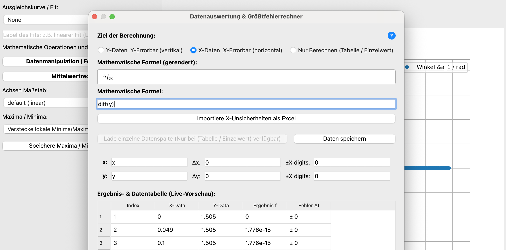
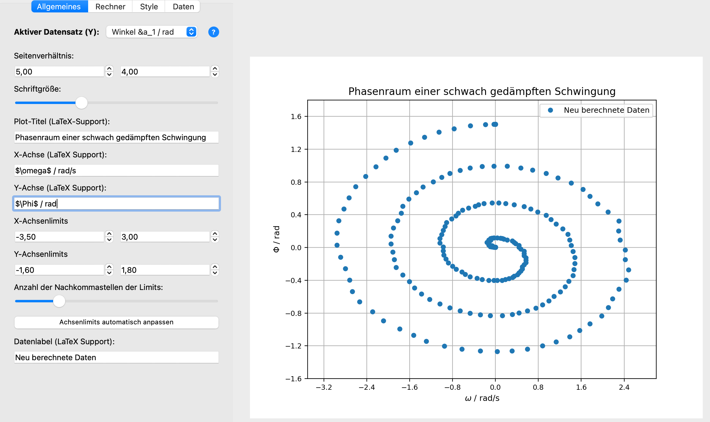
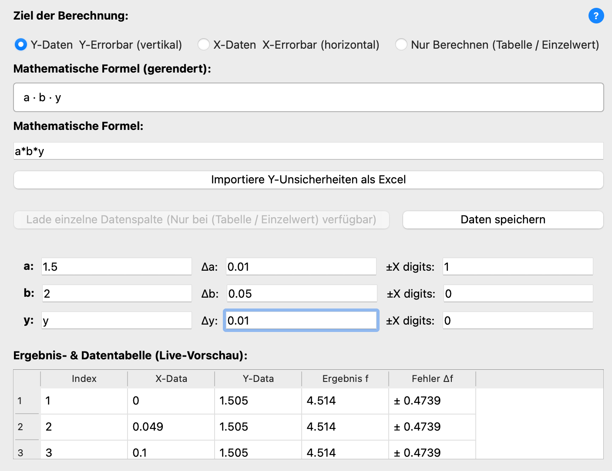
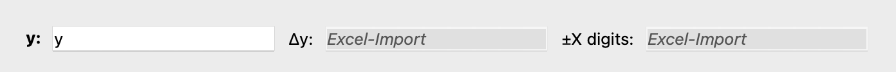
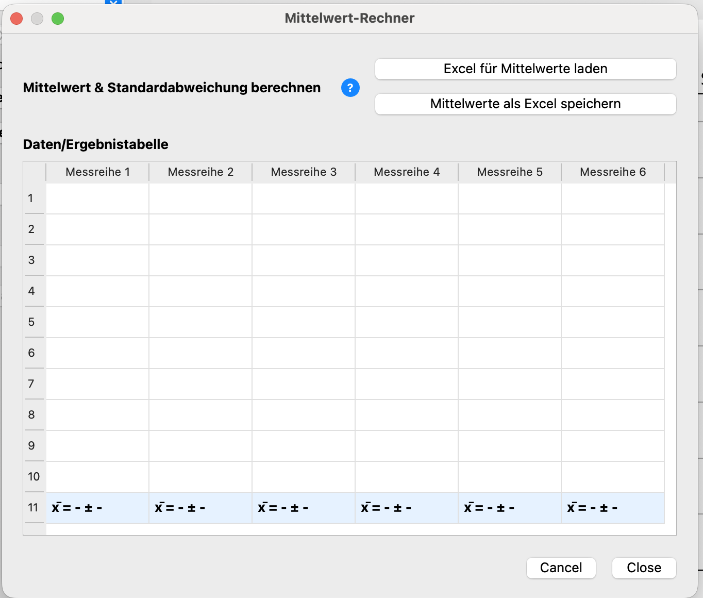
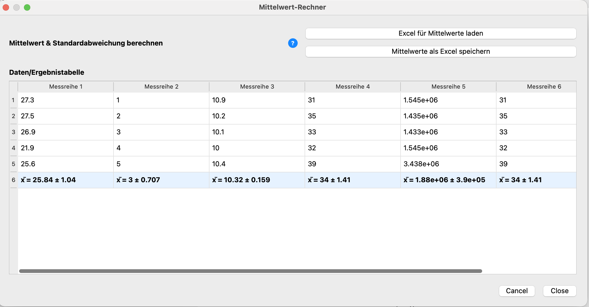
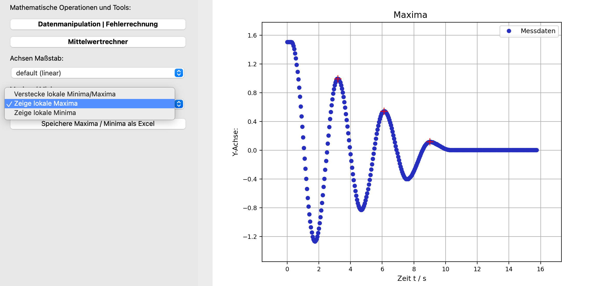

<script>
window.MathJax = {
  tex: {
    inlineMath: [['$', '$'], ['\\(', '\\)']]
  }
};
</script>
<script id="MathJax-script" async src="https://cdn.jsdelivr.net/npm/mathjax@3/es5/tex-chtml.js"></script>

<p align="center">
  
</p>

🌐 **Sprache:** [English](./) | Deutsch

---

**Protokollix** ist ein leichtgewichtiges Desktop-Werkzeug zur schnellen Datenauswertung, interaktiven Plot-Erstellung und automatisierten Größtfehlerberechnung – optimiert für physikalische Praktika und wissenschaftliche Laborberichte, entwickelt, um Zeit bei der Auswertung zu sparen. 

---

## Inhaltsverzeichnis
- [Installation & Download](#installation--download)
  - [Option 1: Fertige Anwendung](#option-1-fertige-anwendung-empfohlen--kein-python-nötig)
  - [Option 2: Aus dem Quellcode ausführen](#option-2-direkt-aus-dem-quellcode-ausführen-python-erforderlich)
- [Schnellstart](#schnellstart)
- [Sprache auswählen](#sprache-auswählen)
- [Dateneinlese und Datenformat (Excel / CSV)](#dateneinlese-und-datenformat-excel--csv)
  - [Daten importieren über Dateien](#daten-importieren-über-dateien)
  - [Daten importieren über Tabellenfunktion](#daten-importieren-mithilfe-der-eingebauten-tabellenfunktion)
  - [Daten exportieren](#daten-exportieren)
- [Grafische Manipulationen im Überblick](#grafische-manipulationen-im-überblick)
- [Mathematische Manipulationen im Überblick](#mathematische-manipulationen-im-überblick)
  - [Ausgleichskurve / Fit](#ausgleichskurvefit)
  - [Größtfehler-Rechner](#größtfehler-rechner)
    - [Auswahlmenü für die Daten](#auswahlmenü-für-die-daten)
    - [Eingabezeile](#eingabezeile)
    - [Unsicherheiten](#unsicherheiten)
    - [Ergebnis- & Datentabelle](#ergebnis----datentabelle)
    - [Anwenden und Zurücksetzen der Änderungen](#anwenden-und-zurücksetzen-der-änderungen)
  - [Mittelwert-Rechner](#mittelwert-rechner)
    - [Funktionsweise & Berechnung](#funktionsweise--berechnung)
    - [Dateneingabe: Datei-Import oder manuelle Tabelle](#dateneingabe-datei-import-oder-manuelle-tabelle)
  - [Maxima- & Minima-Erkennung](#maxima---minima-erkennung)
    - [Anzeige im Plot](#anzeige-im-plot)
    - [Export der Extrema](#export-der-extrema)

---

## Installation & Download

### Option 1: Fertige Anwendung (Empfohlen – kein Python nötig)
Die fertigen Programme für Windows und macOS findest du rechts unter **[Releases](https://github.com/jbreinl/Protokollix/releases)**:

1. Lade für dein Betriebssystem das neueste Archiv herunter (`Protokollix-Windows.zip` oder `Protokollix-macOS-arm64.zip`).
2. Entpacke die ZIP-Datei.
3. Starte die Anwendung per Doppelklick (keine Python-Installation erforderlich).

<div id="important-notice-for-macos-users-gatekeeper-warning" style="background-color: #f1f8ff; border-left: 5px solid #0366d6; padding: 14px 18px; margin: 16px 0; border-radius: 4px; color: #24292e;">
<strong>Wichtiger Hinweis für macOS-Nutzer (Gatekeeper-Warnung):</strong><br>
Da Protokollix ein freies Open-Source-Projekt ist und nicht über ein kostenpflichtiges Apple-Entwicklerzertifikat signiert wurde, stuft macOS die heruntergeladene App beim ersten Start standardmäßig als „nicht verifiziert“ ein (<em>„Apple kann nicht überprüfen, ob die App frei von Schadsoftware ist“</em>).<br><br>
<strong>So startest du die App beim ersten Mal:</strong><br><br>
<strong>Option A (Über die Systemeinstellungen):</strong>
<ol>
  <li>Versuche, <strong>Protokollix</strong> einmalig per Doppelklick zu öffnen (die Gatekeeper-Meldung erscheint) -&gt; klicke auf <strong>Fertig</strong>.</li>
  <li>Öffne die <strong>Systemeinstellungen</strong> deines Macs -&gt; <strong>Datenschutz &amp; Sicherheit</strong>.</li>
  <li>Scrolle nach unten zum Bereich <strong>Sicherheit</strong>.</li>
  <li>Klicke neben dem Hinweis zu Protokollix auf <strong>„Dennoch öffnen“</strong> und bestätige die Abfrage.</li>
</ol>
<strong>Option B (Schnell per Terminal / Quarantäne entfernen):</strong><br>
Falls macOS die App als „beschädigt“ blockiert, öffne das <strong>Terminal</strong> und führe folgenden Befehl aus:
<pre style="background: #e1e4e8; padding: 8px; border-radius: 4px; margin-top: 6px;">xattr -cr /Pfad/zu/Protokollix.app</pre>
</div>

<div id="note-for-windows-users-smartscreen" style="background-color: #f1f8ff; border-left: 5px solid #0366d6; padding: 14px 18px; margin: 16px 0; border-radius: 4px; color: #24292e;">
<strong>Hinweis für Windows-Nutzer (SmartScreen):</strong><br>
Beim ersten Start meldet der Microsoft Defender möglicherweise: <em>„Der Computer wurde durch Windows geschützt“</em>.<br>
* Klicke einfach auf <strong>„Weitere Informationen“</strong> und anschließend auf <strong>„Trotzdem ausführen“</strong>.
</div>

---

### Option 2: Direkt aus dem Quellcode ausführen (Python erforderlich)

Falls du Python bereits installiert hast oder den Quellcode anpassen möchtest:

1. Klone das Repository oder lade `script.py` herunter.
2. Installiere die benötigten Abhängigkeiten im Terminal:

   ```bash
   pip install PySide6 numpy pandas matplotlib scipy sympy openpyxl
   ```

---

## Schnellstart

1. Klicke auf **„Öffne Excel / CSV“** und wähle deine Messdatei aus.
2. Wähle im linken Bedienfeld unter **Allgemeines** die gewünschte Y-Messreihe aus.
3. Passe Achsenbeschriftungen, Skalierung (linear/logarithmisch) und Kurvenanpassungen (z. B. Polynom- oder Exponential-Fit) an.
4. Manipuliere X- und Y-Daten beliebig im Größtfehlerrechner und berechne Mittelwerte mithilfe des Mittelwertrechners. 
5. Exportiere das fertige Diagramm über **„Save Plot“** als hochauflösende PDF- oder PNG-Grafik für dein Protokoll.

---

## Sprache auswählen
Protokollix unterstützt sowohl Deutsch als auch Englisch. Die Sprache kann im entsprechenden Reiter `Bearbeiten` ganz oben am Bildschirm geändert werden. Eine Sprachänderung ist jederzeit während das Programm läuft möglich, einzig interne Fenster wie der Mittelwertrechner und der Größtfehlerrechner akzeptieren eine neue Sprache nur, während sie geschlossen sind / erneut geöffnet werden nach dem Sprachwechsel.  

---

## Dateneinlese und Datenformat (Excel / CSV)

### Daten importieren über Dateien 

Derzeit können entweder Excel oder CSV Dateien importiert werden - andere Dateitypen werden nicht unterstützt. Der Button zum Einlesen von Daten befindet sich im linken Menü im rechtesten Tab **Daten**. 
Damit Protokollix Dateien fehlerfrei einliest, muss die Datei wie folgt aufgebaut sein:

* **Spalte 1:** X-Werte (Messzeit, Spannung, etc.)
* **Folgende Spalten:** Y-Werte (Messreihen)
* Optional: Zeile 1 als Spaltentitel (Header)

| X (Zeit in s) | Y1 (Strom in A) | Y2 (Spannung in V) |
| :--- | :--- | :--- |
| 1.0 | 0.25 | 1.20 |
| 2.0 | 0.51 | 2.38 |
| 3.0 | 0.74 | 3.61 |

Das Programm gibt eine Warnung aus, falls die eingelesenen Daten nicht passen, und zeigt zusätzlich beim Importieren nochmal das erwünschte Format an. 

<div style="background-color: #f1f8ff; border-left: 5px solid #0366d6; padding: 14px 18px; margin: 16px 0; border-radius: 4px; color: #24292e;">
<strong>Dezimaltrennzeichen:</strong> Sowohl Punkte (<code>1.25</code>) als auch Kommas (<code>1,25</code>) werden beim Einlesen automatisch erkannt und konvertiert.
</div>

<div style="background-color: #f1f8ff; border-left: 5px solid #0366d6; padding: 14px 18px; margin: 16px 0; border-radius: 4px; color: #24292e;">
Beim erstmaligen Einlesen der Messdaten mithilfe des <strong>Öffne Excel/CSV</strong> Buttons kann es zu kurzen Verzögerungen kommen. Das Programm signalisiert durch eine Änderung des Mauscursors, dass es im Hintergrund arbeitet. Der Grund dafür ist, dass im Moment des Ladens die Funktion <code>find_peaks</code> aus der Bibliothek <code>SciPy</code> geladen wird, um direkt abzugleichen, ob die Messdaten Maxima und/oder Minima enthalten, was je nach Betriebssystem und Performance 1–10 Sekunden dauern kann.
</div>

---

### Daten importieren mithilfe der eingebauten Tabellenfunktion

Neben der Möglichkeit, Dateien zu laden, ist es für kleine Datenmengen und schnelle Änderungen möglich, Messdaten manuell über die eingebaute Tabellenansicht einzufügen. Diese befindet sich ebenfalls im `Daten-Tab`, links neben dem Plot, wie folgend abgebildet: 

<p align="center">
  <br>
  <em>Abbildung 1: Die integrierte Tabelle zur Dateneingabe und Manipulation</em>
</p>

Sofern keine Messdaten importiert wurden, ist es möglich, Daten in die Tabelle einzugeben und auch wieder zu löschen. Sollten die eingegebenen Messwerte unvollständig sein (also z. B. ein X-Wert oder ein Y-Wert vergessen), so verschwindet der entsprechende Datenpunkt im Plot – der Fehler wird automatisch im Hintergrund abgefangen. Nachdem man Daten auf diese Weise hinzugefügt hat, muss noch im zentralen Messdaten-Auswahlfenster unter dem Tab **Allgemeines** der neu hinzugefügte Datensatz ausgewählt werden:

<p align="center">
  <br>
  <em>Abbildung 2: Der Aktive Datensatz muss im Anschluss über ein kleines Menü ausgewählt werden.</em>
</p>

Die Option `Keine Daten geladen` verschwindet aus dem Auswahlfenster, sobald Daten über den Importierbutton importiert wurden. Die Tabellenansicht kann weiters dafür benutzt werden, um bestehende Messdaten nachträglich geringfügig zu manipulieren – sprich einen Wert durch einen anderen zu ersetzen. Es ist nicht möglich, bereits geladene Wertepaare ganz aus dem Datensatz zu löschen, hierfür muss die Exceltabelle des Imports angepasst werden und anschließend neu geladen werden.

<div style="background-color: #f1f8ff; border-left: 5px solid #0366d6; padding: 14px 18px; margin: 16px 0; border-radius: 4px; color: #24292e;">
Es empfiehlt sich nicht, Protokollix zu benutzen, um Messdaten in der eingebauten Tabelle direkt nach dem Messen im Labor zu protokollieren – hierfür ist eine Excel-Tabelle besser geeignet.
</div>

---

### Daten exportieren

Der Plot kann jederzeit über den `Plot speichern unter...` Button exportiert werden. Hierbei kann zwischen `.png`, `.jpg`, `.svg` und `.pdf` gewählt werden. Nach dem Anklicken öffnet sich ein Fenster, der User wird nach dem gewünschten Speicherort gefragt und kann den Export mit `Save` bestätigen. Es besteht ebenfalls die Möglichkeit, (bearbeitete) Messdaten zu exportieren – mehr dazu unter [Größtfehler-Rechner](#größtfehler-rechner). Außerdem kann mittels eines Schiebereglers der DPI-Wert (Dots per inch) auf vordefinierte Standardwerte gestellt werden. 

---

## Grafische Manipulationen im Überblick

Protokollix unterstützt zahlreiche Features, die sonst einen eigenen Python-Code erfordern würden, indem es im Hintergrund auf die Bibliothek `Matplotlib` zugreift.
Viele Eingabefelder für Text unterstützen außerdem standardmäßig bereits `LaTeX`-Notation. Dabei folgt das Programm dem *"What you see is what you get"*-Prinzip: Sämtliche getätigte Einstellungen werden sofort grafisch umgesetzt, die Grafik, die man exportiert, ist also exakt der Plot, den man im Programm auch sieht. <br>
Angepasst werden können im Plot zum Beispiel:
* Seitenverhältnis des Plots, Schriftgröße, Datenlabel
* X- und Y-Achsenlimits sowie Beschriftungen und der Achsenmaßstab (lineare Achsen, halblogarithmische Achsen, logarithmische Achsen)
* Linestyle (Liniendarstellung), Markerstyle (Darstellung der Datenpunkte) und Markergröße (Größe der Datenpunkte)
* Grid (Gitter) Ja/Nein, Farbe der Linien und der Datenpunkte, Legendenposition

Die entsprechenden Eingabe- und Manipulationsfelder finden sich in den Tabs **Allgemeines**, **Rechner** und **Style**. 
Ein mögliches Beispiel für die verschiedenen Einstellungsmöglichkeiten könnte wie folgt aussehen:

<p align="center">
  <br>
  <em>Abbildung 3: Ein Beispiel für einen Plot, der mit Protokollix erstellt wurde.</em>
</p>

Viele der Funktionen sind selbsterklärend, aufgrund der Vielzahl an Kombinationsmöglichkeiten wurde auf weitere Beispielbilder verzichtet.

---

## Mathematische Manipulationen im Überblick

Eine der größten Stärken des Programms liegt in der Möglichkeit, mathematische Operationen und insbesondere Fehlerrechnung mit Messdaten durchführen zu können.
Zur Verfügung stehen (Stand September 2026): 
* **Ausgleichskurven / Fits:** Fits durch Messdaten legen
* **Datenmanipulation und Fehlerrechnung:** Gängige Manipulationen sowie ein Fehlerrechner, der nach der Größtunsicherheitsmethode arbeitet. Die berechneten Unsicherheiten werden als Fehlerbalken dargestellt.
* **Mittelwertrechner:** Berechnet den Mittelwert und die Standardabweichung von beliebig vielen Messdaten, die extra importiert werden können; mehrere Mittelwertberechnungen gleichzeitig sind möglich.
* **Maxima/Minima:** Berechnet die lokalen Maxima und/oder Minima einer Funktion. Anschließend können diese als Excel-Datei exportiert werden.

---

### Ausgleichskurve/Fit
Häufig ist es in Versuchen nötig, einen Fit durch Messdaten zu legen. In Protokollix findet sich diese Funktion im **Rechner** Tab. Folgende Fits stehen zur Auswahl: 

<p align="center">
  <br>
  <em>Abbildung 4: In einem Dropdown-Menü lässt sich der gewünschte Fit einfach auswählen.</em>
</p>

Ein Fit kann jederzeit gelegt werden. Sobald eine Fitfunktion ausgewählt wurde, kann das Label (die Beschriftung) des Fits in dem darunterliegenden Textfeld eingegeben werden. Die Parameter *inklusive* deren Unsicherheiten werden sofort über dem Fit angezeigt, wie an folgendem Beispiel zu sehen ist:

<p align="center">
  <br>
  <em>Abbildung 5: Ein Beispiel für einen möglichen Fit. Die Fitparameter sind oben rechts zu sehen.</em>
</p>

<div style="background-color: #f1f8ff; border-left: 5px solid #0366d6; padding: 14px 18px; margin: 16px 0; border-radius: 4px; color: #24292e;">
Mehrere Fits im selben Plot sind derzeit <em>nicht</em> möglich, sind im Laboralltag aber auch sehr selten gefragt.
</div>

---

### Größtfehler-Rechner

Durch das Klicken auf den Button `Datenmanipulation Fehlerrechnung` öffnet sich ein eigenes Fenster, der **Rechner**. Dieser enthält einige der wichtigsten Funktionen.

<p align="center">
  <br>
  <em>Abbildung 6: Durch Klicken des Buttons öffnet sich der Rechner.</em>
</p>

---

#### Auswahlmenü für die Daten

Ganz oben im neu geöffneten Fenster stehen drei Auswahlmöglichkeiten zur Verfügung, die unterscheiden, was mit den manipulierten Daten geschieht:
* **Y-Daten & Y-Errorbar (vertikal):** Wird diese Option gewählt, so beziehen sich sämtliche Rechnungen und Unsicherheiten auf die Y-Daten. Ein automatisch generiertes `Y` im Eingabefeld verdeutlicht dies zusätzlich. Ist diese Option gewählt, können also die vorher geladenen Y-Daten manipuliert werden. Die aus den Unsicherheiten generierten Fehlerbalken sind vertikal, weil sie die Y-Unsicherheiten angeben. Will man die manipulierten Daten im Anschluss exportieren, kann der Button `Daten speichern` genutzt werden.
* **X-Daten & X-Errorbar (horizontal):** Wird diese Option gewählt, so beziehen sich sämtliche Rechnungen und Unsicherheiten auf die X-Daten. Ein automatisch generiertes `X` im Eingabefeld verdeutlicht dies zusätzlich. Ist diese Option gewählt, können also die vorher geladenen X-Daten manipuliert werden. Die aus den Unsicherheiten generierten Fehlerbalken sind horizontal, weil sie die X-Unsicherheiten angeben. Will man die manipulierten Daten im Anschluss exportieren, kann der Button `Daten speichern` genutzt werden.
* **Nur Berechnen (Tabelle / Einzelwert):** Teilweise ist es im Laboralltag gar nicht notwendig, Daten zu plotten, sondern es reicht, eine einzelne Messreihe mathematisch zu manipulieren. Protokollix wurde in erster Linie für die Erstellung von Plots optimiert, besitzt jedoch auch eine Funktion für die reine Datenmanipulation ohne grafische Darstellung. Da das Programm beim Import über Excel/CSV immer X- und Y-Daten benötigt, steht im Größtfehlerrechner eine dritte Option zur Auswahl, die ausschließlich Berechnungen dient. Über einen extra Button `Lade einzelne Datenspalte` kann eine einzelne Y-Messreihe geladen und – wie schon bei X- und Y-Daten – manipuliert werden. Im Anschluss können die neu berechneten Daten und ihre Unsicherheiten mithilfe des Buttons `Daten speichern` exportiert werden. 

<div style="background-color: #f1f8ff; border-left: 5px solid #0366d6; padding: 14px 18px; margin: 16px 0; border-radius: 4px; color: #24292e;">
Im <code>Nur Berechnen (Tabelle / Einzelwert)</code> Menü wird auch mithilfe von <code>Y</code> auf die geladenen Daten zugegriffen!
</div>

<div style="background-color: #f1f8ff; border-left: 5px solid #0366d6; padding: 14px 18px; margin: 16px 0; border-radius: 4px; color: #24292e;">
Nicht verwirren lassen: Häufig werden die Messachsen in der Physik nicht mit <code>X</code> und <code>Y</code> bezeichnet – sondern z. B. mit <code>t (für die Zeit)</code> oder <code>x (für den Weg)</code>. Im Größtfehlerrechner erfolgt der Zugriff auf diese Messdaten trotzdem immer mit <code>X</code> und <code>Y</code> – das Programm kann nicht wissen, welche physikalische Größe gemessen wurde.
</div>

---

#### Eingabezeile

Direkt unter dem Auswahlmenü liegen die Zeilen **Mathematische Formel (gerendert)** sowie **Mathematische Formel**:

* **Mathematische Formel (gerendert):** Dieses Feld erlaubt keine Eingaben und dient lediglich der übersichtlichen grafischen Darstellung der eingegebenen Befehle – was vor allem bei komplizierten Formeln hilft, den Überblick zu behalten.
* **Mathematische Formel:** In diesem Feld können Befehle ähnlich wie bei einem Taschenrechner eingegeben werden.

<p align="center">
  <br>
  <em>Abbildung 7: Ein Feld dient der gerenderten Darstellung, eines der Eingabe.</em>
</p>

Der integrierte Rechner nutzt symbolische Computeralgebra (SymPy). Beim Eingeben der Berechnungsformel gelten folgende mathematische Standards:

* Addition/Subtraktion: `+`, `-`
* Multiplikation und Division: `*` (z. B. `m * g * h`), `/` (z. B. `y / 2`)
* Potenzen: `**` (z. B. `r**2` für $r^2$). Die `LaTeX`-Notation `^` kann ebenfalls verwendet werden. Eine e-Funktion wird durch den Ausdruck `exp()` realisiert.
* Funktionen: `sin(...)`, `cos(...)`, `sqrt(...)`, `exp(...)`. <br>
`log(...)` berechnet den Zehnerlogarithmus ($\log_{10}$), während `ln(...)` für den natürlichen Logarithmus steht. Dies weicht zwar von gängigen Programmiersprachen-Konventionen ab, entspricht jedoch der vertrauten Tastenbelegung wissenschaftlicher Taschenrechner und der Schreibweise in der Vorlesung.
* Numerische Ableitungen: `diff(y)` berechnet die numerische Ableitung `dy/dx`.

<div style="background-color: #f1f8ff; border-left: 5px solid #0366d6; padding: 14px 18px; margin: 16px 0; border-radius: 4px; color: #24292e;">
Die Konstante $\pi$ wird durch <code>pi</code> eingegeben, nicht durch <code>Pi</code>! Vergiss nicht, dass die $e$-Funktion durch <code>exp(...)</code> eingegeben werden muss!
</div>

<details markdown="1">
<summary><b>Beispiel anzeigen: Phasenraum einer gedämpften Schwingung darstellen</b></summary>

Um den Phasenraum $(\varphi, \dot{\varphi})$ oder $(x, \dot{x})$ einer gedämpften Schwingung darzustellen, trägst du die Geschwindigkeit bzw. Winkelgeschwindigkeit gegen die Auslenkung auf.

**Ausgangslage:**
Deine Excel-Datei enthält Zeit $t$ (Spalte 1) und Auslenkung/Winkel $\varphi$ (Spalte 2). (Wie in dem oben gezeigten Beispiel einer schwach gedämpften Schwingung)

**Schritt-für-Schritt in Protokollix:**

1. **Winkelgeschwindigkeit berechnen:**
   * Wähle unter `Ziel der Berechnung` *X-Daten* aus. Für den Phasenraum brauchen wir den Winkel $\varphi$ auf der Y-Achse und die Winkelgeschwindigkeit $\omega$ auf der X-Achse. Auf der Y-Achse bleibt also alles gleich, wir müssen nur die X-Achse manipulieren. 

2. **Achsen für das Phasendiagramm anordnen:**
   * Gib im Transformationsfeld `diff(y)` ein (berechnet numerisch $\dot{\varphi} = \frac{d\varphi}{dt}$). Dadurch überschreiben wir die Zeitdaten auf der X-Achse, die wir hier nicht benötigen, mit der Winkelgeschwindigkeit $\omega$. Drücke `OK`.

<p align="center">
  <br>
  <em>Abbildung 8: Um den Phasenraum zu erhalten, müssen die Y-Messdaten (Winkelauslenkung) numerisch abgeleitet werden.</em>
</p>

3. **Ergebnis:**
   * Nach einem Klick auf `Achsenlimits automatisch anpassen` im Tab **Allgemeines** zeigt der Plot die typische spiralförmige Phasenraumtrajektorie, die mit fortschreitender Dämpfung in den Ursprung $(0, 0)$ hineinläuft.

<p align="center">
  <br>
  <em>Abbildung 9: Das resultierende Phasenraumdiagramm der gedämpften Schwingung.</em>
</p>
</details>

---

### Unsicherheiten 

Ein Feature, das **Protokollix** von vielen anderen Programmen unterscheidet, ist die Möglichkeit zur automatischen Fehlerrechnung. Diese basiert auf der Ableitungsmethode (Größtfehlermethode):
$$\Delta f = \sum_i \left| \frac{\partial f}{\partial v_i} \right| \cdot \Delta v_i$$


 Mit jeder Variable, die im Bedienfeld eingegeben wird (sowie automatisch für `X` und `Y`), werden drei Felder generiert:
* Eines für den Wert der Variable
* Eines für die absolute Unsicherheit der Variable
* Eines für die Digitsunsicherheit der Variable (ganzzahlig!)

Im folgenden Beispiel wurden die Variablen `a` und `b` definiert und mit `y` multipliziert: $a = 1.5, \Delta a = 0.01$, Digits(a) = 1, $b = 2, \Delta b = 0.05$.

<p align="center">
  <br>
  <em>Abbildung 10: Ein Beispiel für die Unsicherheitsangabe mit den Variablen a und b.</em>
</p>

Es ist auch möglich, Unsicherheiten zu importieren. Hier gilt wieder das Auswahlprinzip von oben: Ist im Menü `Y-Daten` ausgewählt, so werden die Unsicherheiten als Y-Unsicherheiten betrachtet; ist `X-Daten` ausgewählt, werden die Daten analog als X-Unsicherheiten betrachtet. Sollte eines davon der Fall sein, so wird das entsprechende Feld für die X- bzw. die Y-Unsicherheiten automatisch gesperrt, um Konflikte zu vermeiden – man muss sich also entscheiden, ob man die Unsicherheiten als Ganzes importieren oder manuell hinzufügen möchte. 

<p align="center">
  <br>
  <em>Abbildung 11: Die Y-Unsicherheiten wurden über den Button „Importiere Y-Unsicherheiten aus Excel“ importiert.</em>
</p>

<div style="background-color: #f1f8ff; border-left: 5px solid #0366d6; padding: 14px 18px; margin: 16px 0; border-radius: 4px; color: #24292e;">
Natürlich ist es auch möglich, schrittweise zu arbeiten: So könnte man z. B. erst die Unsicherheiten für eine einzelne Messreihe berechnen (mithilfe des <code>Nur Berechnen (Tabelle / Einzelwert)</code>-Buttons), diese anschließend exportieren, danach die ursprünglichen X- und Y-Werte laden und die eben berechneten Unsicherheiten über den <code>Importiere Unsicherheiten</code>-Button hinzufügen. Diese Vorgehensweise empfiehlt sich vor allem bei komplexeren Aufgabenstellungen.
</div>

---

#### Ergebnis- & Datentabelle
Ganz unten im Größtfehlermenü befindet sich die Live-Vorschau der Daten, die bearbeitet werden sollen:
* `Index` nummeriert die Werte.
* `X-Data` enthält die Messwerte auf der X-Achse.
* `Y-Data` enthält die Messwerte auf der Y-Achse.
* `Ergebnis f` ist eine Kurzschreibweise für *Ergebnis der Funktion f(...).* Hiermit sind schlicht die neu berechneten Werte gemeint – `Ergebnis f` kann also, je nachdem was oben unter `Ziel der Berechnung` ausgewählt ist, die bearbeiteten X-Daten, die bearbeiteten Y-Daten oder die bearbeiteten Werte aus „Lade einzelne Datenspalte“ meinen. 
* `Delta f` ($\Delta f$) bezeichnet die berechnete Größtunsicherheit von *f(...)*.

---

#### Anwenden und Zurücksetzen der Änderungen
Ist man fertig mit den Berechnungen, können die nun neuen X- oder Y-Daten auf den Plot angewendet werden. **Unsicherheiten werden dabei automatisch zu Fehlerbalken!** Einmal angewendet, können die Daten im Tab **Daten** wieder zurückgesetzt werden – hierfür dienen die Buttons `X-Daten zurücksetzen` und `Y-Daten zurücksetzen`.

<div style="background-color: #f1f8ff; border-left: 5px solid #0366d6; padding: 14px 18px; margin: 16px 0; border-radius: 4px; color: #24292e;">
Will man sowohl die X-Messwerte als auch die Y-Messwerte manipulieren oder beiden Unsicherheiten hinzufügen, so ruft man den Größtfehlerrechner zwei Mal auf: Einmal oben X-Daten auswählen, berechnen und <code>OK</code> drücken; im Anschluss erneut öffnen, Y-Daten oben auswählen und wieder mit <code>OK</code> bestätigen.
</div>

---

### Mittelwert-Rechner

Wiederholungsmessungen derselben physikalischen Größe erfordern im Laboralltag häufig eine statistische Auswertung über den arithmetischen Mittelwert und die empirische Standardabweichung. Ein Klick auf den Button **Mittelwertrechner** öffnet das separate Auswertungsfenster.

<p align="center">
  <br>
  <em>Abbildung 12: Das Dialogfenster des Mittelwert-Rechners.</em>
</p>

---

#### Funktionsweise & Berechnung

Der Mittelwert-Rechner ermittelt automatisch die statistischen Kenngrößen nach den Standardformeln der Fehlerrechnung:

* **Arithmetischer Mittelwert ($\bar{x}$):**
  $$\bar{x} = \frac{1}{n} \sum_{i=1}^{n} x_i$$
* **Empirische Standardabweichung der Einzelmessung ($s_x$):** Streuung der Einzelwerte um den Mittelwert.
  $$s_x = \sqrt{\frac{1}{n - 1} \sum_{i=1}^{n} (x_i - \bar{x})^2}$$
* **Vertrauensbereich / Unsicherheit des Mittelwerts ($s_{\bar{x}}$):** Der tatsächliche Fehler des Ergebnisses, der mit zunehmender Messungsanzahl $n$ kleiner wird:
  $$s_{\bar{x}} = \frac{s_x}{\sqrt{n}}$$

---

#### Dateneingabe: Datei-Import oder manuelle Tabelle

Messwerte können auch hier auf zwei Wegen übergeben werden:

1. **Import via Excel/CSV:** Über den Import-Button im Dialog können gezielt Dateien eingelesen werden, die reine Messreihen enthalten. Unterstützt werden auch mehrere Spalten gleichzeitig, sodass verschiedene Messreihen in einem Durchgang analysiert werden. Das benötigte Format wird direkt beim Einlesen angezeigt. 
2. **Manuelle Eingabe:** Ähnlich wie im Hauptprogramm steht eine direkte Tabellenansicht bereit, in die Messwerte zeilenweise eingetragen oder aus der Zwischenablage eingefügt werden können.

<div style="background-color: #f1f8ff; border-left: 5px solid #0366d6; padding: 14px 18px; margin: 16px 0; border-radius: 4px; color: #24292e;">
Über den Button <code>Mittelwerte als Excel speichern</code> können beliebig viele gleichzeitig berechnete Mittelwerte gespeichert werden – was praktisch sein kann, um diese im Anschluss z. B. als neue Daten im Größtfehlerrechner zu laden.
</div>

<details>
<summary><b>Beispiel anzeigen: Mittelwert von importierten Messwerten berechnen</b></summary>

Im folgenden Beispiel wurden mehrere Mittelwerte gleichzeitig berechnet:

<p align="center">
  <br>
  <em>Abbildung 13: Parallele Auswertung mehrerer Messreihen im Mittelwert-Rechner.</em>
</p>
</details>

---

### Maxima- & Minima-Erkennung

Für Resonanzkurven, gedämpfte Schwingungen oder spektroskopische Messungen bietet Protokollix eine automatisierte Peak-Erkennung auf Basis von `scipy.signal.find_peaks`. Die Steuerung befindet sich im Tab **Rechner** unter dem Bereich *Maxima / Minima*.

#### Anzeige im Plot
Über das Dropdown-Menü kann festgelegt werden, welche Extrema der aktiven Messreihe hervorgehoben werden sollen:
* **Verstecke lokale Minima/Maxima:** Standardansicht (keine Markierungen).
* **Zeige lokale Maxima:** Markiert alle gefundenen Hochpunkte mit roten `+`-Symbolen direkt im Diagramm.
* **Zeige lokale Minima:** Markiert alle Tiefpunkte entsprechend im Diagramm.

<p align="center">
  <br>
  <em>Abbildung 14: Über ein Menü können die Maxima oder Minima der Daten angezeigt und exportiert werden.</em>
</p>

<div style="background-color: #f1f8ff; border-left: 5px solid #0366d6; padding: 14px 18px; margin: 16px 0; border-radius: 4px; color: #24292e;">
Die Auswertung erfolgt strikt auf der aktuell ausgewählten Y-Messreihe. Die Auswahlliste und der Export-Button werden automatisch deaktiviert, wenn keine Daten geladen sind oder keine signifikanten Peaks erkannt wurden.
</div>

#### Export der Extrema
Über den Button **„Speichere Maxima / Minima als Excel“** können die gefundenen Wertepaare direkt als separate Excel- (`.xlsx`) oder CSV-Datei (`.csv`) exportiert werden. 

Die exportierte Datei gliedert sich in vier Spalten:
* `Minima (x)` & `Minima (y)`
* `Maxima (x)` & `Maxima (y)`
